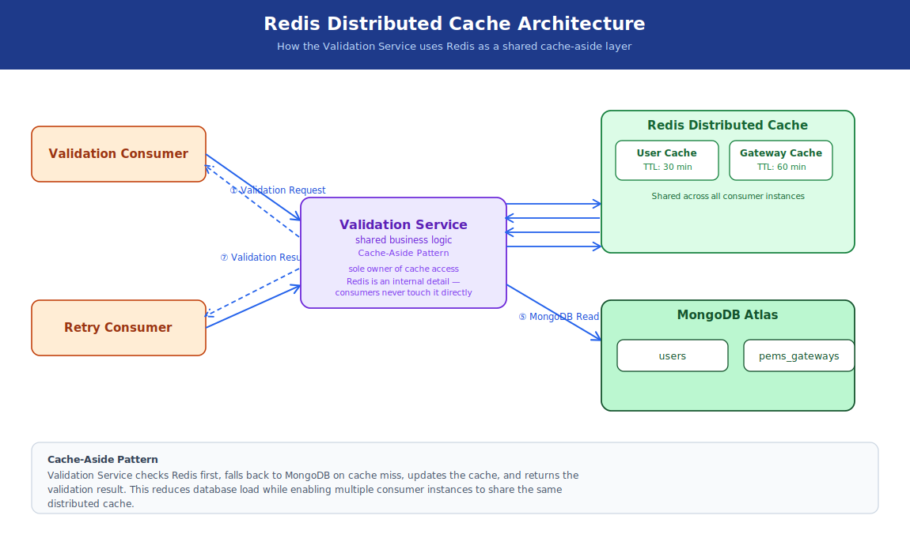
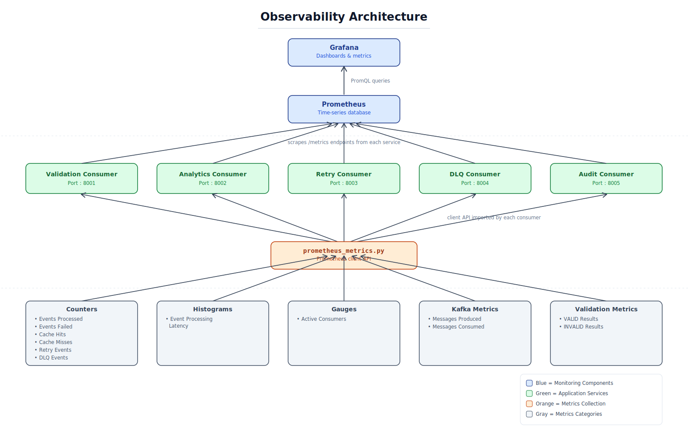
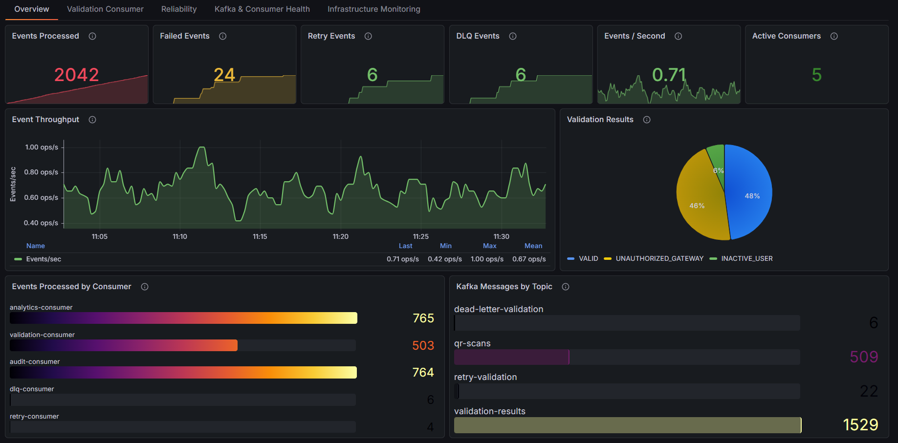
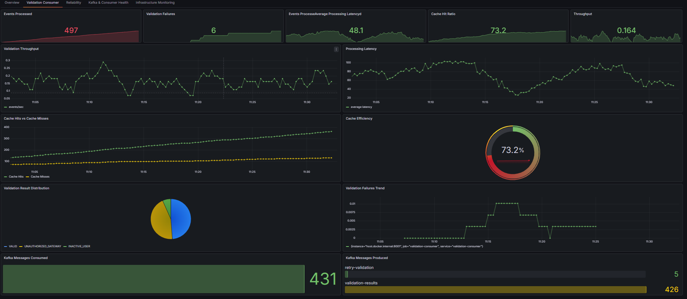
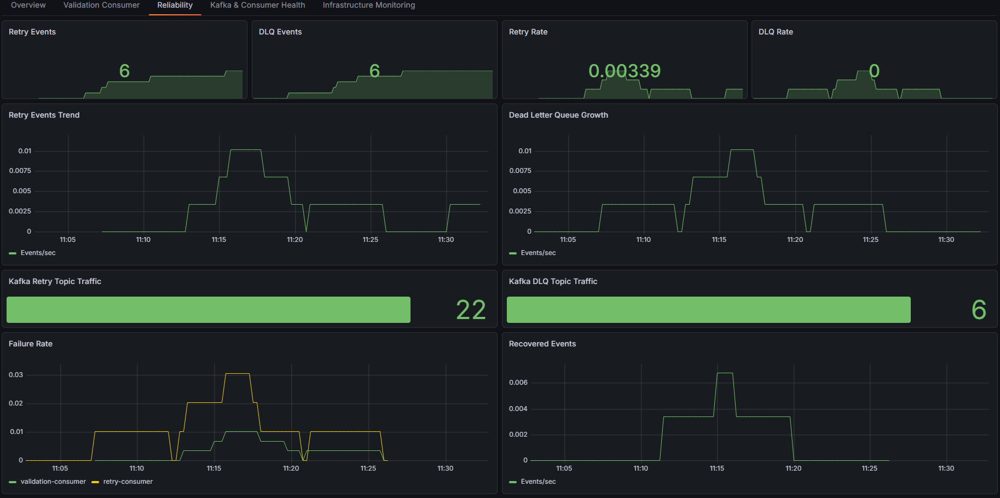
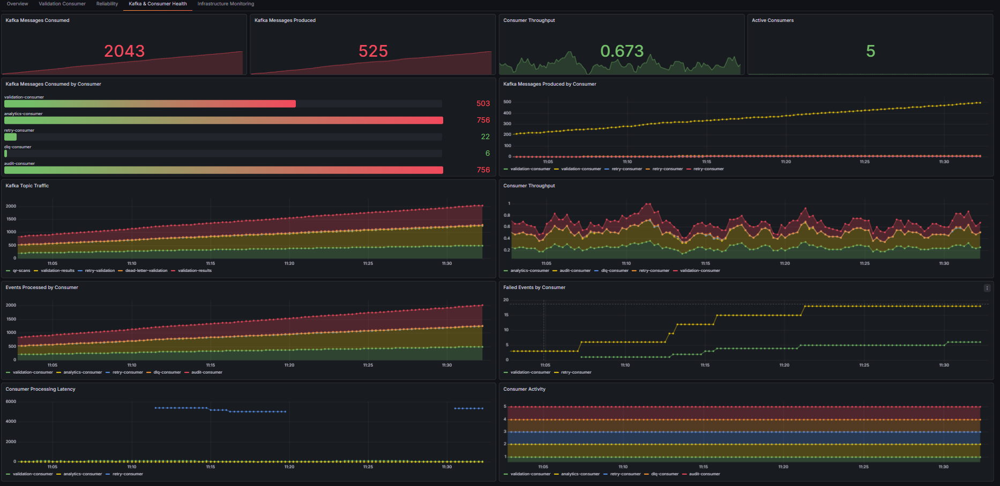
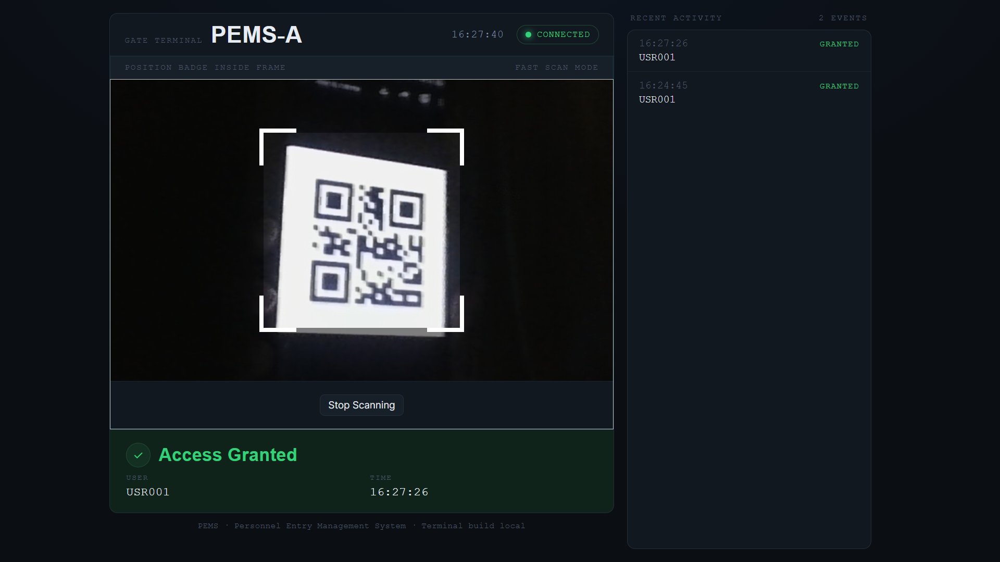

# PEMS Analytics & Monitoring Platform

> A production-inspired event-driven access control platform built with **FastAPI**, **Apache Kafka**, **MongoDB Atlas**, **Redis**, **Prometheus**, and **Grafana**.


---

## Overview

PEMS Analytics & Monitoring Platform is a real-time event-driven backend system that validates employee QR code scans at multiple PEMS gateways.

Instead of tightly coupling business logic into a single service, every QR scan is published as an event to Apache Kafka, allowing multiple independent consumers to process the same event simultaneously.

Version 4 adds a full observability layer on top of the reliability and caching work done in V3 — every consumer and the gateway now expose Prometheus metrics, and Grafana dashboards give a live view of throughput, cache performance, retries, and Kafka consumer health.

The project demonstrates how modern distributed systems handle scalability, reliability, and observability using asynchronous event processing.

---

## Features

### Real-Time Processing

- QR code based employee validation
- WebSocket communication
- FastAPI Gateway
- Multi-gateway support
- Event-driven processing

### Apache Kafka

- Producer / Consumer architecture
- Fan-out event processing
- Independent consumers
- Multi-partition support
- Horizontal scalability

### Reliability

- Manual offset commits
- Retry mechanism
- Retry topic
- Dead Letter Queue (DLQ)
- DLQ Replay
- Failure recovery

### Analytics

- Hourly access analytics
- Gateway-wise statistics
- Historical scan events
- Processing latency tracking

### Caching

- Redis distributed cache
- Shared cache across consumer instances
- Reduced MongoDB reads
- Improved validation latency
- Cache hit/miss monitoring

### Observability (New in V4)

- Prometheus instrumentation across all consumers and the gateway
- Grafana dashboards for application and Kafka health
- Consumer lag monitoring
- Batched metrics aggregation
- Service health monitoring

---

# Technology Stack

| Layer | Technology |
|--------|------------|
| Frontend | HTML, CSS, JavaScript |
| QR Scanner | html5-qrcode |
| Backend | FastAPI |
| Language | Python |
| Streaming | Apache Kafka (KRaft mode) |
| Database | MongoDB Atlas |
| Cache | Redis |
| Communication | WebSocket |
| Metrics | Prometheus |
| Dashboards | Grafana |
| Containerization | Docker Compose |

---

# System Architecture

> **Architecture Diagram**


*(Updated in V4 to include Redis cache-aside reads and Prometheus scraping every consumer.)*

---

# Event Lifecycle

> **Event Processing Flow**


---

# Project Structure

```text
PEMS-ANALYTICS-PLATFORM
│
├── app
│   ├── api
│   │   ├── routes
│   │   └── main.py
│   │
│   ├── config
│   │   ├── database.py
│   │   ├── kafka.py
│   │   ├── redis.py
│   │   └── settings.py
│   │
│   ├── consumers
│   │   ├── validation_consumer.py
│   │   ├── analytics_consumer.py
│   │   ├── audit_consumer.py
│   │   ├── retry_consumer.py
│   │   └── dlq_consumer.py
│   │
│   ├── metrics
│   │   ├── metrics_buffer.py
│   │   └── metrics_flusher.py
│   │
│   ├── models
│   │   └── event_envelope.py
│   │
│   ├── observability
│   │   ├── prometheus.yml
│   │   └── prometheus_metrics.py
│   │
│   ├── repositories
│   │   ├── __init__.py
│   │   ├── analytics_repository.py
│   │   ├── audit_repository.py
│   │   ├── dead_letter_repository.py
│   │   ├── gateway_repository.py
│   │   ├── metrics_repository.py
│   │   └── user_repository.py
│   │
│   ├── scripts
│   │   └── replay_dlq.py
│   │
│   ├── services
│   │   ├── cache_service.py
│   │   └── validation_service.py
│   │
│   ├── simulator
│   │   └── traffic_simulator.py
│   │
│   ├── utils
│   │   ├── current_time_stamp.py
│   │   ├── event_builder.py
│   │   └── event_id_generator.py
│   │
│   └── data
│       ├── pems_gateways.json
│       └── users.json
│
├── docs
│   └── images
│       ├── system_architecture.svg
│       ├── event_lifecycle.svg
│       ├── event_envelope.svg
│       ├── kafka_topics.svg
│       ├── retry_dlq.svg
│       ├── cache_flow.svg
│       ├── metrics_pipeline.svg
│       ├── observability_architecture.svg
│       └── screenshots/
│
├── frontend
│   ├── assets
│   ├── PEM-A.html
│   └── PEM-B.html
│
├── qrcodes
│
├── .env
├── .gitignore
├── docker-compose.yml
├── README.md
├── requirements.txt
└── test.py
```

---

## Architecture Overview

The platform follows an **event-driven architecture** where each QR scan is published as an immutable event to Apache Kafka.

Each consumer has a single responsibility:

- **Validation Consumer** validates employee access, checking Redis before falling back to MongoDB.
- **Analytics Consumer** computes hourly statistics.
- **Audit Consumer** stores immutable event history.
- **Retry Consumer** retries failed validations.
- **DLQ Consumer** stores permanently failed events.

Every consumer also exposes Prometheus metrics, scraped continuously and visualized in Grafana, so the whole pipeline is observable end-to-end rather than just log-visible.

This design allows each component to evolve independently while improving scalability, fault tolerance, and observability.

---

# Event Envelope

Every event in the platform follows a standardized **Event Envelope** format.

This keeps communication between producers and consumers consistent while enabling tracing, retries, replay, and future schema evolution.

> **Event Envelope**


### Metadata

| Field | Description |
|--------|-------------|
| eventId | Unique identifier for the event |
| version | Event schema version |
| eventType | Current stage of the event lifecycle |
| eventTime | Time when the event was created |
| producer | Service that produced the event |
| retryCount | Number of retry attempts |
| nextRetryAt | Scheduled retry timestamp |
| traceId | Tracks a request across services |
| correlationId | Groups related events |
| arrivedAt | Timestamp when consumer received the event |
| processedAt | Timestamp when processing completed |

### Payload

| Field | Description |
|--------|-------------|
| userId | Employee ID |
| pemId | PEMS Gateway ID |
| source | Event source (QR Scanner, Simulator, etc.) |
| validationStatus | Validation result |

### Sample Event

```json
{
  "metadata": {
    "eventId": "EVT-20260712163240-001",
    "version": "3.0",
    "eventType": "VALIDATION_COMPLETED",
    "eventTime": "2026-07-12T11:02:40.630Z",
    "producer": "validation-consumer",
    "retryCount": 0,
    "nextRetryAt": null,
    "traceId": "19e6a18c-9599-4922-9b17-334fd5db1297",
    "correlationId": "14c46c7a-7eaf-4a2e-a062-32454b1bd245",
    "arrivedAt": "2026-07-12T11:02:52.999Z",
    "processedAt": "2026-07-12T11:02:54.557Z"
  },
  "payload": {
    "userId": "USR036",
    "pemId": "PEMS-A",
    "source": "QR_SCANNER",
    "validationStatus": "VALID"
  }
}
```

---

# Kafka Topics

The platform uses multiple Kafka topics to decouple services and support reliable event processing.

> **Kafka Topic Architecture**


| Topic | Producer | Consumers | Purpose |
|-------|----------|-----------|---------|
| `qr-scans` | Gateway | Validation Consumer | Incoming scan events |
| `validation-results` | Validation / Retry Consumer | Gateway, Analytics, Audit | Successful validation events |
| `retry-validation` | Validation / Retry Consumer | Retry Consumer | Failed events scheduled for retry |
| `dead-letter-validation` | Retry Consumer | DLQ Consumer | Permanently failed events |

---

# MongoDB Collections

| Collection | Purpose |
|------------|---------|
| `users` | Employee master data |
| `pems_gateways` | Gateway configuration |
| `audit_logs` | Immutable audit trail |
| `analytics_hourly` | Hourly aggregated analytics |
| `metrics` | Runtime service metrics |
| `dead_letter_events` | Permanently failed events |

---

# Reliability

The platform implements multiple reliability patterns commonly used in distributed systems.

## Retry Mechanism

- Manual Kafka offset commits
- Configurable retry attempts
- Retry delay scheduling
- Event replay support
- Retry metadata tracking

---

## Dead Letter Queue (DLQ)

Events that exceed the maximum retry attempts are moved to a Dead Letter Queue.

Instead of losing failed events, they are stored for later investigation and replay.

> **Retry & DLQ Flow**


---

## DLQ Replay

The platform supports replaying failed events after the root cause has been resolved.

Replay resets retry metadata and republishes the event back to the retry pipeline.

Benefits:

- No data loss
- Easier recovery
- Operational flexibility
- Better debugging

---

# Distributed Caching

Redis sits in front of MongoDB as a shared cache across all consumer instances, cutting validation latency and database read load.

> **Cache Flow**



### Benefits

- Faster validation lookups
- Reduced MongoDB read load
- Shared cache across horizontally scaled consumers
- Cache hit/miss visibility via Prometheus

---

# Metrics Optimization

Version 3 introduced buffered metrics aggregation; Version 4 builds on it with Prometheus instrumentation.

Instead of updating MongoDB for every processed event, each consumer stores metrics in memory. A background flusher periodically writes aggregated metrics to MongoDB, while the same metrics are simultaneously exposed live via Prometheus.

> **Metrics Pipeline**


### Benefits

- Reduced database writes
- Lower MongoDB load
- Higher throughput
- Better scalability
- Live, queryable metrics in addition to persisted history

---

# Observability

Version 4 adds a full monitoring layer: every consumer and the gateway expose a `/metrics` endpoint scraped by Prometheus, and Grafana visualizes that data as live dashboards.

> **Observability Architecture**



## Prometheus Metrics

| Metric | Type | Description |
|--------|------|-------------|
| `events_processed_total` | Counter | Total events processed |
| `events_failed_total` | Counter | Total events that failed processing |
| `cache_hits_total` | Counter | Redis cache hits |
| `cache_misses_total` | Counter | Redis cache misses |
| `retry_events_total` | Counter | Events sent to the retry topic |
| `dlq_events_total` | Counter | Events sent to the dead letter topic |
| `validation_results_total` | Counter | VALID / INVALID validation outcomes |
| `kafka_messages_consumed_total` | Counter | Messages consumed per topic/consumer |
| `kafka_messages_produced_total` | Counter | Messages produced per topic/producer |
| `event_processing_latency_ms` | Histogram | End-to-end event processing latency |
| `active_consumers` | Gauge | Number of currently active consumer instances |

## Grafana Dashboards


**Dashboard 1 — System Overview**



**Dashboard 2 — Validation Consumer**



**Dashboard 3 — Reliability (Retry / DLQ)**



**Dashboard 4 — Kafka & Consumer Health**



**Dashboard 5 — Infrastructure Monitoring** *(planned)*

---

# REST APIs

## Health

| Method | Endpoint |
|---------|----------|
| GET | `/` |

---

## Metrics

| Method | Endpoint | Description |
|---------|----------|-------------|
| GET | `/metrics` | Prometheus scrape endpoint |
| GET | `/metrics/{service}` | Get buffered metrics for a specific service |

---

## Analytics

| Method | Endpoint | Description |
|---------|----------|-------------|
| GET | `/analytics/hourly` | Hourly analytics |
| GET | `/analytics/gateway/{pemId}` | Gateway-wise analytics |

---

# Getting Started

## Prerequisites

Before running the project, ensure the following are installed:

- Python 3.12+
- Apache Kafka (KRaft Mode)
- MongoDB Atlas
- Redis
- Docker Desktop
- Git

---

# Installation

## Clone the Repository

```bash
git clone https://github.com/thirumalamakkena/pems-gate-system/

cd pems-gate-system
```

---

## Create a Virtual Environment

### Windows

```bash
python -m venv .venv

.venv\Scripts\activate
```

### Linux / macOS

```bash
python3 -m venv .venv

source .venv/bin/activate
```

---

## Install Dependencies

```bash
pip install -r requirements.txt
```

---

## Configure Environment

Update your application configuration with:

- MongoDB Atlas Connection String
- Kafka Bootstrap Server
- Kafka Topic Names

Example:

```python
MONGO_URI=<your-mongodb-uri>

BOOTSTRAP_SERVERS=localhost:9092
```

---

# Running the Platform

## 1. Start Kafka, Redis, Prometheus & Grafana

```bash
docker compose up -d
```

Verify Kafka, Redis, Prometheus, and Grafana are all running.

---

## 2. Start the FastAPI Gateway

```bash
uvicorn app.api.main:app --reload
```

---

## 3. Start Consumers

### Validation Consumer

```bash
python -m app.consumers.validation_consumer
```

### Analytics Consumer

```bash
python -m app.consumers.analytics_consumer
```

### Audit Consumer

```bash
python -m app.consumers.audit_consumer
```

### Retry Consumer

```bash
python -m app.consumers.retry_consumer
```

### DLQ Consumer

```bash
python -m app.consumers.dlq_consumer
```

---

## 4. Start the Frontend

```bash
python -m http.server 5500 -d frontend
```

Open your browser:

```
http://localhost:5500/PEM-A.html
```

---

## 5. Access Observability

```
Prometheus:  http://localhost:9090
Grafana:     http://localhost:3000
```

---

# Load Testing

The project includes an event simulator for generating high-volume QR scan events.

Example configuration:

- Multiple simulated users
- Multiple gateways
- Adjustable events per second
- Configurable test duration

Typical workflow:

```
Simulator

↓

Kafka

↓

Consumers

↓

MongoDB / Redis
```

Recommended test scenarios:

| Scenario | Description |
|----------|-------------|
| Low Load | 10 events/sec |
| Medium Load | 50 events/sec |
| High Load | 100+ events/sec |
| Burst Load | Short-duration spikes |

Tracked during load tests (visible live in Grafana):

- Kafka throughput (produced / consumed per second)
- Redis cache hit vs. miss ratio under load
- End-to-end event processing latency
- Retry and DLQ volume under induced failure

---

# Performance Optimizations

Version 4 builds on the reliability and caching foundation from V3 with full observability.

### Event Envelope

- Standardized event format
- Better traceability
- Easier debugging

---

### Retry Pipeline

- Automatic retry
- Retry delay
- Configurable retry attempts
- Dead Letter Queue support

---

### Redis Cache

- Cache-aside pattern in front of MongoDB
- Shared across horizontally scaled consumers
- Cache hit/miss ratio tracked as a Prometheus metric

---

### Metrics Buffer

Instead of writing metrics for every event:

```
Consumer

↓

Metrics Buffer (Memory)

↓

Metrics Flusher (Every 5 Seconds)

↓

MongoDB
```

At the same time, Prometheus scrapes each service's live in-memory counters directly — no flush delay for dashboards.

Benefits:

- Reduced MongoDB writes
- Lower latency
- Improved throughput
- Live observability without extra database load

---

# Screenshots


**Frontend Gate Scanner**



---

# Architecture Diagrams

The repository includes the following architecture diagrams.

| Diagram | Description |
|----------|-------------|
| `system_architecture.svg` | Complete platform architecture |
| `event_lifecycle.svg` | QR scan event lifecycle |
| `event_envelope.svg` | Standard event structure |
| `kafka_topics.svg` | Kafka topic relationships |
| `retry_dlq.svg` | Retry and DLQ workflow |
| `cache_flow.svg` | Redis cache-aside read/write flow |
| `metrics_pipeline.svg` | Buffered metrics aggregation |
| `observability_architecture.svg` | Prometheus scraping & Grafana dashboard flow |

---

# Roadmap

The project has been developed incrementally to simulate how a production-grade event-driven platform evolves over time.

## ✅ Version 1 — Foundation

- QR code scanning
- FastAPI Gateway
- Apache Kafka integration
- MongoDB persistence
- WebSocket communication
- Repository pattern

---

## ✅ Version 2 — Event-Driven Processing

- Fan-out architecture
- Validation Consumer
- Analytics Consumer
- Audit Consumer
- Hourly analytics
- Monitoring APIs
- Load testing

---

## ✅ Version 3 — Reliability & Performance

### Event Architecture

- Event Envelope
- Redis Distributed Cache
- Metadata & Payload structure
- Event versioning
- Trace ID
- Correlation ID

### Reliability

- Manual Kafka Offset Commits
- Retry Topic
- Retry Consumer
- Retry Delay
- Dead Letter Queue (DLQ)
- DLQ Consumer
- DLQ Replay

### Performance

- Metrics Buffer
- Background Metrics Flusher
- Batched MongoDB Updates
- Reduced Database Writes

---

## ✅ Version 4 — Observability

- Prometheus Integration
- Grafana Dashboards
- Consumer Lag Monitoring
- Kafka Metrics
- Custom Alerts *(in progress)*
- End-to-End Tracing *(in progress)*

---

## 🚧 Planned Improvements

### Version 5 — Production Readiness

- Full Dockerization of the application
- Kubernetes deployment
- CI/CD Pipeline
- Authentication (OAuth2 / JWT)
- Role-Based Access Control

---

# Learning Outcomes

This project demonstrates practical implementation of modern backend engineering and distributed systems concepts.

## Backend Engineering

- FastAPI
- Repository Pattern
- REST APIs
- WebSockets
- Service Layer Design
- Event-Driven Design

---

## Distributed Systems

- Apache Kafka
- Producer / Consumer Architecture
- Fan-Out Processing
- Retry Patterns
- Dead Letter Queue
- Event Replay
- Event Envelope
- Horizontal Scalability

---

## Data Engineering

- MongoDB Atlas
- Aggregation
- Metrics Collection
- Event Streaming
- Batch Processing
- Performance Optimization

---

## Distributed Caching

- Redis
- Cache-aside pattern
- Shared cache
- Cache hit/miss optimization

---

## Observability & Monitoring

- Prometheus instrumentation
- Grafana dashboard design
- Consumer lag tracking
- Metric types: Counters, Histograms, Gauges

---

## Software Engineering

- Modular Architecture
- Fault Tolerance
- Reliability
- Performance Testing
- Logging
- Clean Code Practices

---

# Future Enhancements

Some ideas for extending the platform include:

- Apache Spark Streaming
- Elasticsearch
- OpenTelemetry end-to-end tracing
- Alertmanager integration
- Kubernetes
- CI/CD Pipeline
- OAuth2 / JWT Authentication
- Role-Based Access Control
- Multi-Tenant Support
- Machine Learning Based Access Prediction
- Smart Campus Dashboard
- Smart City Event Platform

---

# Contributing

Contributions, suggestions, and improvements are welcome.

If you would like to contribute:

1. Fork the repository.
2. Create a feature branch.

```bash
git checkout -b feature/my-feature
```

3. Commit your changes.

```bash
git commit -m "Add my feature"
```

4. Push to your branch.

```bash
git push origin feature/my-feature
```

5. Open a Pull Request.

---

# Author

**Thirumala**

Backend & Data Engineering Enthusiast

- Python
- Apache Kafka
- MongoDB
- Redis
- FastAPI
- Prometheus & Grafana
- Distributed Systems
- System Design

GitHub:

```
https://github.com/thirumalamakkena
```

LinkedIn:

```
https://www.linkedin.com/in/thirumala-makkena
```

---

# Acknowledgements

This project was built as a hands-on learning platform to explore distributed systems concepts through practical implementation.

Special focus areas include:

- Event-Driven Architecture
- Apache Kafka
- MongoDB Atlas
- Redis
- FastAPI
- Reliability Patterns
- Performance Optimization
- Observability & Monitoring
- System Design

---

# Architecture Assets

The README references the following diagrams and screenshots located in:

```text
docs/images/
docs/images/screenshots/
```

| File | Description |
|------|-------------|
| system_architecture.svg | Complete platform architecture |
| event_lifecycle.svg | End-to-end event flow |
| event_envelope.svg | Event metadata and payload structure |
| kafka_topics.svg | Kafka topics and consumers |
| retry_dlq.svg | Retry and Dead Letter Queue workflow |
| cache_flow.svg | Redis cache-aside flow |
| metrics_pipeline.svg | Buffered metrics aggregation |
| observability_architecture.svg | Prometheus & Grafana monitoring flow |
| screenshots/frontend.png | Gate scanner frontend |
| screenshots/prometheus.png | Prometheus targets view |
| screenshots/grafana_*.png | Grafana dashboards |

---

# License

This project is licensed under the MIT License.

See the `LICENSE` file for more information.

---

## Repository Summary

| Category | Details |
|----------|---------|
| Architecture | Event-Driven |
| Language | Python |
| Framework | FastAPI |
| Streaming | Apache Kafka |
| Database | MongoDB Atlas |
| Cache | Redis |
| Communication | WebSocket |
| Reliability | Retry, DLQ, Replay |
| Monitoring | Prometheus, Grafana, Metrics Buffer & Batch Flusher |
| Scalability | Multi-Consumer Kafka Architecture |
| Version | V4 |

---

> ⭐ If you found this project useful, consider giving the repository a star!