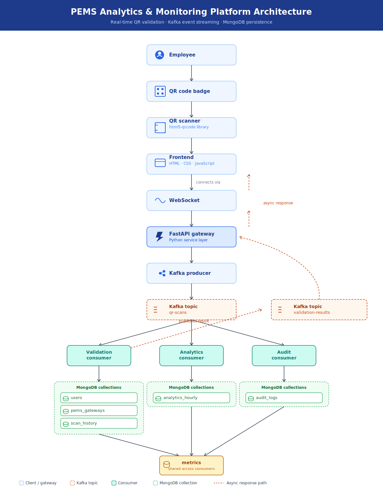
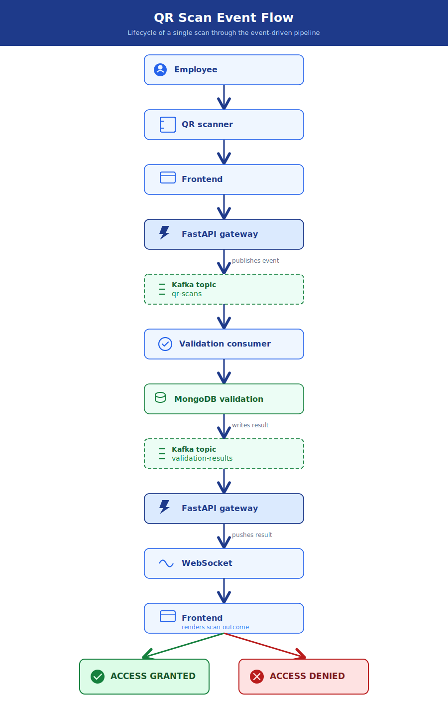

# PEMS Analytics & Monitoring Platform

A real-time event-driven access control and analytics platform built using **FastAPI**, **Apache Kafka**, and **MongoDB Atlas**.

The platform validates employee QR code scans at multiple PEMS gateways and processes every scan event through independent Kafka consumers for validation, analytics, auditing, and system monitoring.

---

# Project Overview

The PEMS Analytics & Monitoring Platform extends a traditional gate access system into a scalable event-driven platform.

Whenever an employee scans a QR code:

- The scan is sent to the FastAPI Gateway.
- The Gateway publishes the event to Apache Kafka.
- Multiple independent consumers process the same event.
- Validation results are returned to the frontend through WebSockets.
- Every event contributes to analytics, monitoring, and audit history.

The architecture is designed to be scalable and can evolve into a Smart Campus or Smart City event processing platform.

---

# Objectives

- Implement a real-time QR code validation system.
- Design a scalable fan-out event-driven architecture using Apache Kafka.
- Compute real-time analytics for gate access events.
- Maintain immutable audit history for every scan.
- Expose monitoring metrics through REST APIs.
- Evaluate the performance of the system under different workloads and cache configurations.

---

# System Architecture


---

# Technology Stack

| Layer | Technology |
|---------|------------|
| Frontend | HTML, CSS, JavaScript |
| QR Scanner | html5-qrcode |
| Backend | FastAPI |
| Language | Python |
| Streaming | Apache Kafka |
| Database | MongoDB Atlas |
| Communication | WebSocket |
| Containerization | Docker |

---

# Project Structure

```
PEMS-ANALYTICS-PLATFORM
│
├── app
│   ├── api
│   │   ├── main.py
│   │   └── routes
│   │
│   ├── config
│   │   ├── database.py
│   │   ├── kafka.py
│   │   └── settings.py
│   │
│   ├── consumers
│   │   ├── validation_consumer.py
│   │   ├── analytics_consumer.py
│   │   └── audit_consumer.py
│   │
│   ├── repositories
│   │   ├── user_repository.py
│   │   ├── gateway_repository.py
│   │   ├── scan_repository.py
│   │   ├── analytics_repository.py
│   │   └── metrics_repository.py
│   │
│   ├── services
│   │   └── validation_service.py
│   │
│   ├── utils
│   │
│   └── data
│
├── frontend
│
├── tests
│
├── docs
│
├── docker-compose.yml
│
├── requirements.txt
│
└── README.md
```

---

# Database Design

## users

Stores employee master information.

Example fields

- userId
- name
- role
- status
- allowedPems

---

## pems_gateways

Stores gateway master data.

Example fields

- gatewayId
- gatewayName
- building
- campusId
- status

---

## scan_history

Stores every QR scan event.

Purpose

- Historical reporting
- Event replay
- Debugging
- Audit support

---

## analytics_hourly

Stores hourly aggregated statistics.

Metrics

- Total scans
- Valid scans
- Invalid scans
- Average processing time

---

## metrics

Stores runtime metrics for every service.

Metrics include

- Events processed
- Events failed
- Cache hits
- Cache misses
- Total latency
- Last updated

---

# Kafka Topics

## qr-scans

Producer

- FastAPI Gateway

Consumers

- Validation Consumer


---

## validation-results

Producer

- Validation Consumer

Consumer

- FastAPI Gateway
- Analytics Consumer
- Audit Consumer

---

# Event Flow



---

# MongoDB Collections

| Collection | Purpose |
|------------|---------|
| users | Employee master data |
| pems_gateways | Gateway master data |
| scan_history | Every scan event |
| analytics_hourly | Hourly aggregated analytics |
| metrics | Service monitoring metrics |

---

# Features

- Real-time QR code validation
- Event-driven architecture
- Apache Kafka fan-out processing
- MongoDB Atlas integration
- WebSocket communication
- Hourly analytics
- Immutable event history
- Cache-enabled validation
- REST APIs
- Monitoring metrics

---

# Cache Strategy

The Validation Consumer caches frequently accessed users and gateways in memory.

Benefits

- Reduces MongoDB reads
- Improves validation latency
- Reduces database load
- Improves throughput

Metrics tracked

- Cache Hits
- Cache Misses

---

# Monitoring

The platform exposes runtime metrics including

- Events Processed
- Events Failed
- Average Latency
- Cache Hits
- Cache Misses

through REST APIs.

---

# Running the Project

## Clone Repository

```bash
git clone <repository-url>

cd PEMS-ANALYTICS-PLATFORM
```

---

## Create Virtual Environment

```bash
python -m venv .venv
```

---

## Activate

Windows

```bash
.venv\Scripts\activate
```

Linux / macOS

```bash
source .venv/bin/activate
```

---

## Install Dependencies

```bash
pip install -r requirements.txt
```

---

## Start Kafka

```bash
docker-compose up -d
```

---

## Start Gateway

```bash
uvicorn app.api.gateway:app --reload
```

---

## Start Consumers

Validation Consumer

```bash
python -m app.consumers.validation_consumer
```

Analytics Consumer

```bash
python -m app.consumers.analytics_consumer
```

Audit Consumer

```bash
python -m app.consumers.audit_consumer
```

---

## Start Frontend

```bash

python -m http.server 5500 -d frontend
```

Open

```
http://localhost:5500/index.html
```

---

## Start FastAPI

```bash
uvicorn app.api.main:app --reload
```

---

# REST APIs

| Endpoint | Description |
|-----------|-------------|
| GET / | Health Check |
| GET /metrics | Service metrics |
| GET /metrics/{service} | Metrics by service |
| GET /analytics/hourly | Hourly analytics |
| GET /analytics/gateway/{pem_id} | Hourly analytics BY PEMID|


---

# Future Enhancements

- Redis Distributed Cache
- Docker Deployment
- Kubernetes
- Prometheus Metrics
- Grafana Dashboard
- JWT Authentication
- Role-Based Access Control
- Multi-campus Deployment
- Smart City Integration
- Machine Learning based traffic prediction

---

# Learning Outcomes

This project demonstrates practical implementation of

- Event-Driven Architecture
- Apache Kafka
- MongoDB Atlas
- FastAPI
- WebSockets
- Repository Pattern
- Distributed Systems
- Caching
- Real-Time Analytics
- Monitoring
- System Design

---

# Author

**Thirumala**

**Shanmukha Sai Kishore**
